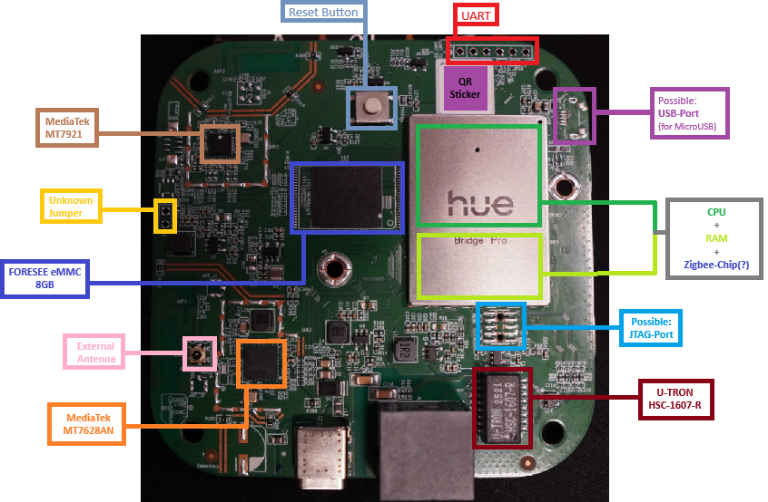
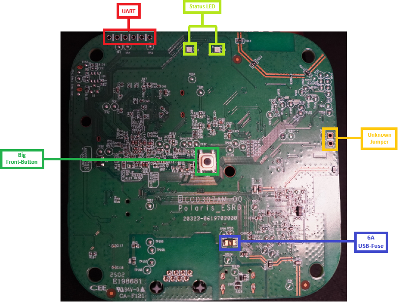
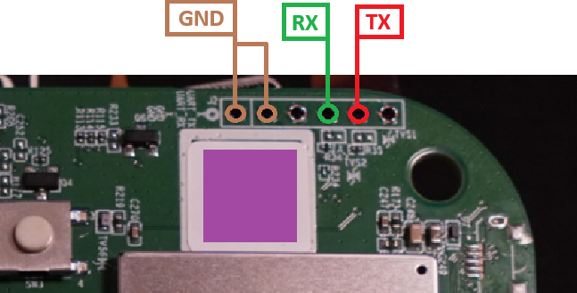

# HueBridgePro-Rooting
Informations about the rooting for Philips Hue Bridge Pro (`BSB003`).

# Platine / PCB
<ins>Chips:</ins>
- **Wifi/Bluetooth**:
  - MediaTek MT7921 WiFi 6 + Bluetooth 5.2
  - Amlogic W155S2, WiFi 5 (802.11ac) + Bluetooth 5.2 Combo
- **Network:**
  - Chip: MediaTek MT7628AN, Network-SoC with Ethernet Switch + WiFi 2.4 GHz
  - Transformator: U-TRON HSC-1607-R
- **Storage:** FORESEE eMMC 8GB NAND-Flash

<ins>Possible under the aluminium socket:</ins>
- **Zigbee**: Unknown
- **CPU:** Unknown
- **RAM:** Unknown

### Front

[Full size](Pictures/PCB_Front_Marked.png) | [Plain board](Pictures/PCB_Front.png)

### Back

[Full size](Pictures/PCB_Back_Marked.png) | [Plain board](Pictures/PCB_Back.png)

# UART
**Baudrate:** `921600`



# First Hello
```
AOCPU: configure PMP for memory 0xf7018000 ~ 0xf7023c00
AOCPU: configure PMP end

Starting AOCPU FreeRTOS...
AOCPU image version='bl-3.5.7 d1430ee372a6e6996304956e3d4ad44b8ff4dc35 05:50:16 2025-11-25'
AOCPU_IRQ_SEL=0x0
AOCPU_IRQ_SEL=0x0
AOCPU_IRQ_SEL=0x0
AOCPU_IRQ_SEL=0x0
[AOCPU]: mailbox init start
[AOCPU]: mailbox init end
Starting timer ...
Starting task scheduler ...
env_init: Environment MMC init done (ret=-2)
```

# Questions
- Why is it not possible to enter anything?
- Why is the baud rate different from the old bridges (`BSB002`)?
- How do we disrupt the boot process?
